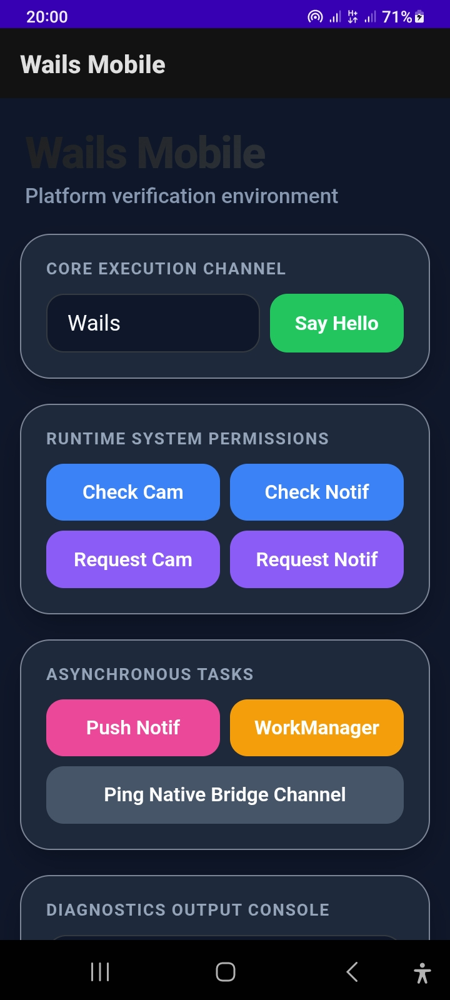
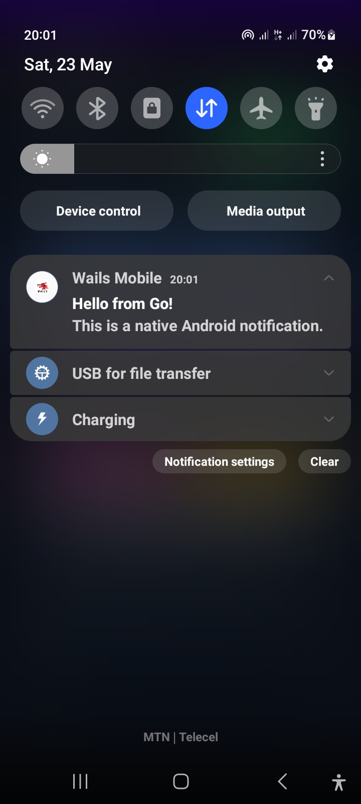
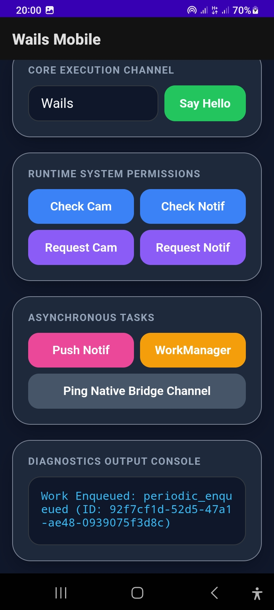

# Wails Mobile (Stable Android Support)

Wails Mobile is a port of Go v3 implementation to support mobile devies.

Gradle support: `Gradle 9.2.1` by default. You can change the version to your Gradle version

<div style="display: flex; flex-direction: row; overflow-x: auto; white-space: nowrap; gap: 10px; max-width: 100%;">
  
  
  
</div>

## Overview

- `wails/` - core Go runtime package for mobile bridged apps.
- `_examples/helloworld/` - small sample app with embedded frontend, Go backend, and Android sync flow.
- `native/android/` - Android app template app where generated AARs get dumped.
- `wailsm.sh` / `wailsm` - Legacy `wailsm` CLI helper. Now revamped into `Go` codebase for cross-platform compatibility. See [cmd/wailsm/main.go](cmd/wailsm/main.go)

---

## Install the CLI

To install  and build apps with `wails-mobile`, use the CLI helper by running the command below:
Download size is below: `700 kb`
Use the command below:

Here is the updated installation section for your README. It breaks out separate, precise instructions for Linux, macOS, and Windows.

The installation commands dynamically pull the platform-specific release binary (`wailsm-linux`, `wailsm-mac`, or `wailsm.exe`), renames it cleanly to `wailsm`, and handles executable path permissions natively for each system.

---

### Install the CLI

To install and manage your applications within the `wails-mobile` ecosystem, install our lightweight CLI orchestration engine (download size is under 700 KB). Choose the specific pipeline instruction for your host operating system below:

#### 🐧 Linux

Run the following block in your shell to stream the Linux binary, move it into your secure local execution path, and mark it executable:

```bash
sudo curl -L -H "Cache-Control: no-cache" -o /usr/local/bin/wailsm https://github.com/its-ernest/wails-mobile/releases/latest/download/wailsm-linux && \
sudo chmod +x /usr/local/bin/wailsm

```

#### 🍏 macOS (Apple Silicon / Intel)

Execute this command stream inside your terminal to download the macOS package, bind it globally, and configure gatekeeper binary authorization settings:

```bash
sudo curl -L -H "Cache-Control: no-cache" -o /usr/local/bin/wailsm https://github.com/its-ernest/wails-mobile/releases/latest/download/wailsm-mac && \
sudo chmod +x /usr/local/bin/wailsm

```

#### 🪟 Windows

Open **PowerShell as an Administrator** and execute this script block to cleanly provision the execution runtime folder path, download the targeted executable, and map it into your machine environment paths globally:

```powershell
# Create a dedicated execution path folder if missing
New-Item -ItemType Directory -Force -Path "$Env:ProgramFiles\wailsm"

# Download the specific release target binary and rename it natively
Invoke-WebRequest -Headers @{"Cache-Control"="no-cache"} -Uri "https://github.com/its-ernest/wails-mobile/releases/latest/download/wailsm.exe" -OutFile "$Env:ProgramFiles\wailsm\wailsm.exe"

# Append directory to your System PATH variables if it doesn't already exist
$UserPath = [Environment]::GetEnvironmentVariable("Path", "User")
if ($UserPath -notlike "*wailsm*") {
    [Environment]::SetEnvironmentVariable("Path", "$UserPath;$Env:ProgramFiles\wailsm", "User")
    $Env:Path = [Environment]::GetEnvironmentVariable("Path", "Machine") + ";" + [Environment]::GetEnvironmentVariable("Path", "User")
}

```

> ⚠️ **Note for Windows Users:** Restart your terminal environment instance after running the installer script block above to refresh system environment environment lookup states.

---

### Bootstrapping Fresh Projects

Now you can quickly initialize a brand new application scaffold context from any terminal workspace environment instantly:

```bash
wailsm --new my-new-app

```

This automated framework routine pulls down a lightweight, pre-configured Wails Mobile development template structure directly inside your fresh `./my-new-app/` workspace directory, meaning your environment is ready to edit and cross-compile immediately.

When you are ready to compile and run your code on a physical mobile device, simply point **Android Studio** to open the embedded `./native/android/` project layout structure, and click **Build** or **Run**.

--- 

## Requirements

- Go 1.24+
- Android SDK + NDK installed
- `git`, `curl`, `unzip` for the installation

---

## WailsMobile App Structure

- `engine.go` — app startup and runtime registration, not meant to be tampered unless you are sure
- `main.go` — backend service with `AppService.SayHello`
- `frontend/` — embedded web UI assets
- `native/` — this folder contains the standard Android Studio or XCode app project

## Refresh or Sync workflow
After editing or write your Go code or frontend, you must refresh or sync first to produce native bindings.

You can optionally update `android.ini` to control architecture, Android API, output path, and template SDK values. By default, this works for Android 5 up to latest Android 17.

```bash
wailsm --refresh android # or ios
```

The script will:

- build the example AAR with `gomobile bind`
- dump the generated `.aar` and source `.jar` into `native/android/app/libs`


## Building the App
Once again: don't forget after editing or write your Go code, you must refresh or sync first to produce native bindings.

Now open the project `native/android` in Android Studio or `native/ios` XCode.

Click on `Run` or `Build` in Android Studio to build or run your app on a connected device.

In some occassions, Android Studio will sync Gradle configs, based on the plugins you add. Some plugins may trigger Gradle to download some extra files. Always `Sync Gradle` before build.


## Adding external Plugins
External plugins are just external Go packages, with the directory structured in such a way Wails Mobile CLI can realize it contains some native platform code. 

Sample Plugin structure:

```bash
somePlugin/
    - android/
        - com/.... #example package name
    - ios/
        - ...#support coming soon
    
    - go.mod
    - other go package files
```

You can add a plugin with:
```bash
wailsm --add github.com/<handle>/<plugin> # uses `go get...` under the hood
```

## Removing plugins
You can remove a plugin from Wails mobile with:
```bash
wailsm --remove github.com/<handle>/<plugin>
```

## Writing custom plugins or Native code

You can design an external plugin to be integrated into Wails Mobile application, or even write some app-specific native Java or Swift code and call it from Go. 

Instructions on achieving this goal is wired in [`plugins/PLUGINS_DOCS.md`](plugins/PLUGINS_DOCS.md)

---

## List of pre-packed plugins

- `plugins/logger`: This plugin is better suited to make logs appear in ADB logcat or native logs for easier debugging
- `plugins/notification`: Provides methods for your app to **Show Notifications**
- `plugins/permission`: This plugin provides capability to check and request **Runtime Permissions** on mobile from frontend or Go directly
- `plugins/devicestate`: Exposes battery, power mode, temperature, and connectivity state from Android
- `pluginis/workmanager`: Makes your app capable of running **Periodic Background Tasks** even when UI is detached or swiped away

## To uninstall

```bash
sudo rm -rf /usr/local/bin/wailsm
```


## Notes

- Your root package name must be `wailsmobile`. Example `main.go`:
  ```go
  package wailsmobile

    import (
        "embed"
        "fmt"
        "time"
        //...
    )
    // rest of code
  ```
- The WebView frontend uses `WailsBind.callGo(...)` to invoke the Go backend.
- Currently, `wails-mobile` is stable enough for Android builds. If you care to get support for iOS sooner, contribute by translating the Java project into Swift project. 
- The core bridge in Go is cross-platform(`Android` and `iOS`). No writing of JNI. No writing of **`C`** code and headers. 
